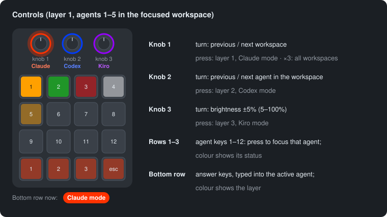
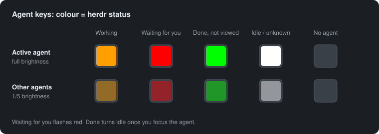
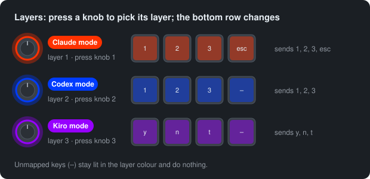
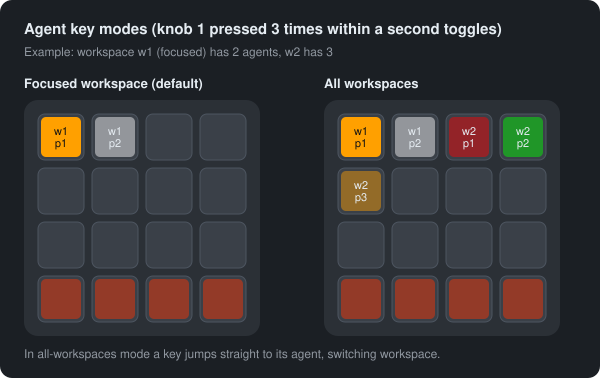
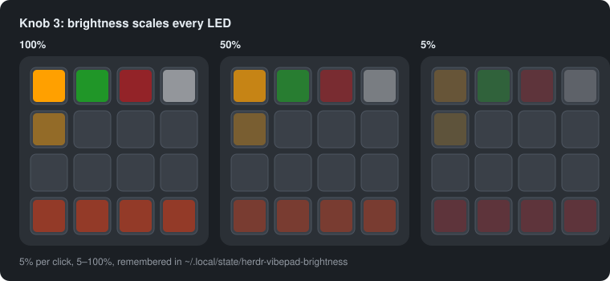
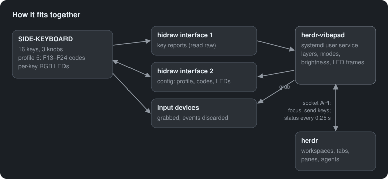

# agentpad — side keyboard as a herdr controller

`agentpad` turns the [SDINNOVATION SIDE-KEYBOARD (USB `6d7d:dcfc`, 16 keys and 3
knobs)](https://link.amazon/B0gofdvCL) into a controller for [herdr](https://herdr.dev) workspaces and agents:
knobs move between workspaces and agents, keys jump to agents and answer their
prompts, and the key LEDs show what every agent is doing. It runs as the
systemd user service `agentpad`.

| Control | Action |
|---|---|
| knob 1 turn | previous / next workspace (wraps) |
| knob 2 turn | previous / next agent in the focused workspace (wraps) |
| knob 3 turn | all LEDs brighter / dimmer, 5% per click (5–100%, remembered) |
| knob 1 / 2 / 3 press | switch to layer 1 / 2 / 3: Claude / Codex / Kiro mode |
| knob 1 press ×3 within 1 s | toggle the agent keys between the focused workspace and all workspaces |
| top 3 rows | key N focuses agent N (left to right, top to bottom) |
| bottom row | typed into the active agent: the keys depend on the layer |

## What the lights mean

### Agent keys: status

Each of the top 12 keys stands for one agent, and its colour is herdr's status
for that agent. The active agent (the focused pane) is at full brightness,
the others at a fifth. Keys without an agent are off.

| herdr status | Colour |
|---|---|
| `working` | yellow |
| `blocked`: an approval or question is waiting for you | flashing red (0.5 s on, 0.5 s off) |
| `done`: finished and not yet viewed | green (turns idle once you focus the agent) |
| `idle`, `unknown` | white |

### Bottom row: layers

Pressing a knob selects its layer. The bottom row shows the layer's colour at
20% brightness and sends that layer's keys to the active agent: answer
numbered options, confirm with `y` or `n`, or cancel with `esc`.

| Layer | Mode | Knob press | Colour | Bottom row, left to right |
|---|---|---|---|---|
| 1 | Claude | knob 1 | reddish orange | `1` `2` `3` `esc` |
| 2 | Codex | knob 2 | blue | `1` `2` `3` `esc` |
| 3 | Kiro | knob 3 | purple | `y` `n` `t` `esc` |

The daemon starts in layer 1.

### Agent key modes

By default the agent keys cover the focused workspace, ordered by tab then
pane. Pressing knob 1 three times within a second switches them to every
workspace (ordered by workspace, tab, pane): pressing a key then jumps
straight to that agent, switching workspace if needed. Three more presses
switch back. Knob 2 always steps through the focused workspace's agents.
The mode isn't shown on the pad; the log says `agent keys: all workspaces`
or `agent keys: focused workspace`.

### Brightness

Turning knob 3 scales every LED in 5% steps between 5% and 100%. The level
survives restarts (`~/.local/state/agentpad-brightness`). At the lowest levels
the dimmest keys (the bottom row, other agents) can look off.

The diagrams are generated from the daemon's own layout and colour code by
`just diagrams`. They're schematic: the knobs aren't drawn where they sit on
the real pad, and screen colours only approximate the LEDs.

## How it works

**Startup.** `agentpad` opens the pad's configuration interface (hidraw,
USB interface 2) and makes sure the pad is set up. Everything below is
checked every time the daemon starts or the pad is plugged back in. A new or
factory-reset pad is configured without the vendor's app.

1. It switches the pad to **profile 5** (of the pad's 6) if it isn't already.
2. It reads profile 5's 25 slots (16 keys, and press / right / left for each
   knob) and rewrites any slot that doesn't send its expected code. Before the
   first write it saves the old mapping to `~/.side-keyboard-keys-backup-p5.json`.
3. It puts the LEDs in per-key colour mode at the pad's own maximum brightness
   (4 of 4). All dimming after that is done in software.

| Slots | Code sent |
|---|---|
| keys, pad slots 0–11 | F13–F24 |
| keys, pad slots 12–15 | shift+F13–F16 |
| knob 1 press / right / left | shift+F17 / F18 / F19 |
| knob 2 press / right / left | shift+F20 / F21 / F22 |
| knob 3 press / right / left | shift+F23 / F24, ctrl+F13 |

**Reading keys.** Linux's keyboard driver drops F13–F24 from this pad and
passes through only the shift and ctrl modifiers, so the daemon can't use
normal key events. Instead it reads the raw 8-byte key reports from the pad's
hidraw interface 1 (`[modifiers, 0, six key codes]`). A key counts as pressed
when its code first appears in a report. The daemon also takes exclusive hold
(`EVIOCGRAB`) of the pad's input devices and discards their events, so
nothing it sends reaches the desktop.

**Key and LED numbering.** The pad numbers its keys and LEDs column by column,
starting bottom left. The daemon converts that to physical positions, left to
right and top to bottom:

    pad index at each      physical position
    physical position      (used in the code)
     3  7 11 15             0  1  2  3
     2  6 10 14             4  5  6  7
     1  5  9 13             8  9 10 11
     0  4  8 12            12 13 14 15

**Talking to herdr.** The daemon sends newline-delimited JSON requests to
herdr's socket, `~/.config/herdr/herdr.sock` (set `AGENTPAD_HERDR_SOCK` for
another session). It uses these methods:

- `workspace.list` and `agent.list` to read state;
- `workspace.focus` and `agent.focus` for the knobs and agent keys;
- `pane.send_keys` for the bottom row, because `agent.send_keys` only accepts
  named agents.

It re-reads the state every 0.25 s and after every press. If herdr isn't
running, the agent keys just go dark until it is.

**Lights.** Each loop turns the current state into 16 colours and scales them
by the brightness. It sends them to the pad as one 48-byte per-key write, and
only when the frame has changed. The red flash uses the clock (0.5 s halves),
so the loop redraws at least every 0.25 s.

**Permissions and service.** `packaging/70-side-keyboard.rules` gives the
logged-in user access to the pad's hidraw and input nodes. It does that
through the `uaccess` tag and, for WSL, the `plugdev` group, so the daemon
needs no sudo. The daemon runs as a systemd user service with `Restart=always`.
If the pad is unplugged it waits and sets the pad up again when it returns.

**What's kept.** Brightness is saved to a file. The layer (back to 1) and the
agent-key mode (back to focused workspace) reset when the daemon restarts.

## Install

Needs Linux with systemd and udev, and herdr running as your user. `just`
recipes wrap every command below; run `just` to list them.

**From a release `.deb`** (Debian/Ubuntu), download it from the GitHub
release, or build it with `just deb`, then:

    sudo apt install ./agentpad_<version>_amd64.deb
    systemctl --user daemon-reload && systemctl --user start agentpad

The package installs the `agentpad`, `side-keyboard-keys` and
`side-keyboard-led` commands, the udev rule, and a user service that is
enabled for every user (it starts at login).

**From this checkout:**

    just install

This needs a Rust toolchain (e.g. via [rustup](https://rustup.rs)) on the machine.
This builds a release binary (`cargo build --release`) and installs the
`agentpad`, `side-keyboard-keys` and `side-keyboard-led` commands to
`~/.local/bin`, installs the udev rule to `/etc/udev/rules.d` (uses sudo), and
writes, enables and starts `~/.config/systemd/user/agentpad.service`. There's
no editable install, so after changing the code, run `just install` again
(not just `just restart`) to pick it up. `just uninstall` undoes it.

## Develop

    just sync        # cargo fetch
    just check       # cargo clippy + cargo fmt --check + shellcheck, then cargo test
    just fmt         # format and apply safe lint fixes
    just diagrams    # regenerate docs/*.svg from the daemon's layout and colours
    just deb         # build dist/agentpad_<version>_amd64.deb
    just deb-test    # also install it in a clean ubuntu:24.04 container and smoke-test it (docker)
    just logs        # follow the service log

The tests need no hardware or herdr: `tests/support/` runs a fake herdr
socket, and the key-decoding tests replay HID reports captured from the pad.

Code lives in `src/`: `daemon.rs` is the service, `keys.rs` and `led.rs` speak
the pad's config protocol, `hid.rs` wraps the raw device I/O, and `herdr.rs`
is the herdr socket client. `src/bin/` has the four binaries: `agentpad` (the
daemon), `side-keyboard-keys` and `side-keyboard-led` (thin CLIs over
`keys.rs` and `led.rs`), and `diagrams` (dev-only, regenerates the README's
SVGs). Tunables are constants near the top of `daemon.rs`: `BOTTOM_KEYS`,
`LAYER_COLORS`, `BOTTOM_BRIGHTNESS`, `BRIGHTNESS_STEP`, `BRIGHTNESS_MIN`,
`INACTIVE_DIM`, `PAD_PROFILE`, and the `status_color` function.

The version lives in `Cargo.toml`.

## CI and releases

`.github/workflows/ci.yml` runs on pushes to `main`, pull requests and tags:
lint (`cargo clippy`, `cargo fmt --check`, shellcheck), tests on Rust stable,
then builds the `.deb`, smoke-tests it in a container and uploads it as a
build artifact. Pushing a tag `v<version>` that matches `Cargo.toml` also
publishes a GitHub release with the `.deb` attached:

    git tag v0.1.0 && git push origin v0.1.0

## Running under WSL2

WSL2 can't see USB devices by default, so the pad is passed through with
[usbipd-win](https://github.com/dorssel/usbipd-win). Microsoft's WSL kernel
(6.6 and later) includes the HID and hidraw drivers the daemon needs. While
the pad is attached to WSL, Windows can't use it. These steps are untested on
real WSL: they follow the usbipd-win docs and the WSL 6.6 kernel config.

**1. Windows, once** (PowerShell as administrator):

    winget install --exact dorssel.usbipd-win
    usbipd list                       # note the BUSID of 6d7d:dcfc (SDINNOVATION SIDE-KEYBOARD)
    usbipd bind --busid <BUSID>

**2. Windows, each session** (normal PowerShell, WSL running):

    usbipd attach --wsl --busid <BUSID> --auto-attach

`--auto-attach` keeps running and re-attaches the pad after an unplug or a WSL
restart. Leave it open, or start it at logon with Task Scheduler.

**3. WSL, once:**

- Turn on systemd by putting this in `/etc/wsl.conf`, then run
  `wsl --shutdown` in Windows and reopen WSL:

      [boot]
      systemd=true

- Check the kernel: `uname -r` should be 6.6 or later (`wsl --update` in
  Windows if not).
- Check you're in `plugdev` (`groups`). If not, run
  `sudo usermod -aG plugdev $USER` and restart WSL.
- Install as above: the `.deb` on Ubuntu/Debian in WSL, or `just install`
  from a checkout.
- herdr must run inside WSL: the daemon talks to the WSL-side herdr socket.

**4. Check it:**

    lsusb | grep 6d7d                              # pad attached
    ls -l /dev/hidraw*                             # its nodes, group plugdev
    journalctl --user -u agentpad -f               # should say "pad ready"

If the pad is in `lsusb` but has no `/dev/hidraw*` nodes, load the drivers
with `sudo modprobe usbhid hid_generic evdev`. To load them at every boot, run
`printf 'usbhid\nhid_generic\nevdev\n' | sudo tee /etc/modules-load.d/side-keyboard.conf`.
If `modprobe` can't find them, update the WSL kernel. Missing
`/dev/input/event*` nodes are fine on WSL: the daemon only grabs them to keep
keys away from a Linux desktop.

## Undo

    just uninstall                                   # or: sudo apt remove agentpad
    side-keyboard-keys restore --profile 5           # the pad's original profile-5 mapping
    side-keyboard-keys profile 4                     # the profile that was active before
    side-keyboard-led raw 01 00 01 04 04 00 01 ff aa ff ff   # previous solid-blue lighting

Run the `side-keyboard-*` commands before uninstalling, or from a built
checkout: `./target/release/side-keyboard-keys ...`.

When the daemon isn't running, profile 5 keys send F13–F24 to the desktop.

## Known limitations

- **The knob lights can't be controlled.** Writing LED indices 16–18 (by
  per-key or bulk write) changes nothing, and the pad reports only one
  lighting zone, the 16 keys.
- **Without the daemon, the keys type F13–F24.** Profile 5 stays active, so
  presses reach the desktop and may trigger shortcuts.
- **The agent-key mode isn't shown on the pad,** and neither mode nor layer
  survives a restart.
- **Only one herdr session.** The daemon follows one herdr socket, by default
  the main session's.
- **WSL is untested** (see above).
